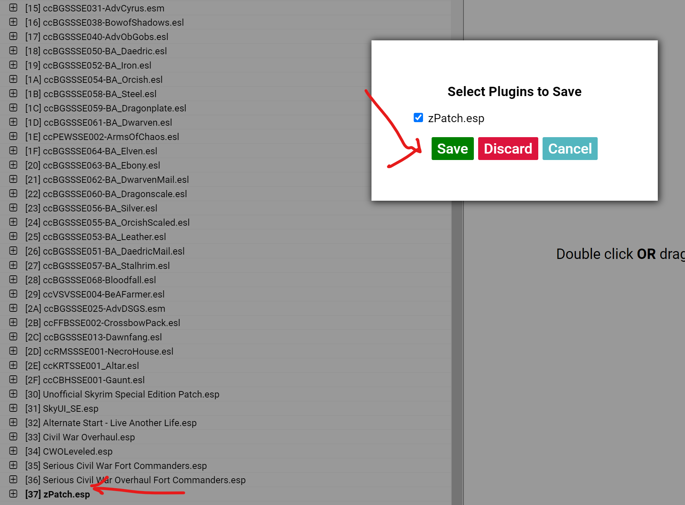

# CWO Troop Patcher
This is a plugin based on the [zEdit](https://github.com/z-edit/zedit) Framework by [matortheeternal](https://github.com/matortheeternal). This plugin allows you to create a custom patch where you can tailor the troops that show up during Civil War Sieges to your personal taste in one easy to use interface.

## How to Use

### 1. Download and install [zEdit](https://github.com/z-edit/zedit/releases)

Once installed and you are using a Mod Manager (like Mod Organizer or Vortex), you can add the zEdit.exe like any other program to it.

### 2. Download the CWO Troop Patcher from the CWO Mod Page or [my Github Repo](https://github.com/schofida/CWORR/releases). It should be in .Zip Format.

### 3. Install the CWO Patcher into zEdit by launching ZEdit and clicking on the 3 cubes on the top right.

### 4. Re-launch zEdit and have it load your mod list. Ensure that **Civil War Overhaul.esp** is in your load order.

### 5. Click on the little puzzle piece on the right to launch the Unified Patching Framework and the click on the **Civil War Overhaul Patcher** on the left. From there, you can adjust the frequency and minimum player level for any soldier that may appear during a siege.

### 6. Go to the Build Patches section and then click Build All.

### 7. Your zPatch file should be created. Simply exit zEdit to Save.

Although zEdit cannot esl-ify (not sure of the proper word) the file, once the patch is created, you can load the zPatch.esp file into TES5Edit and set the esl flag on this file so it won't take up a spot in your load order.