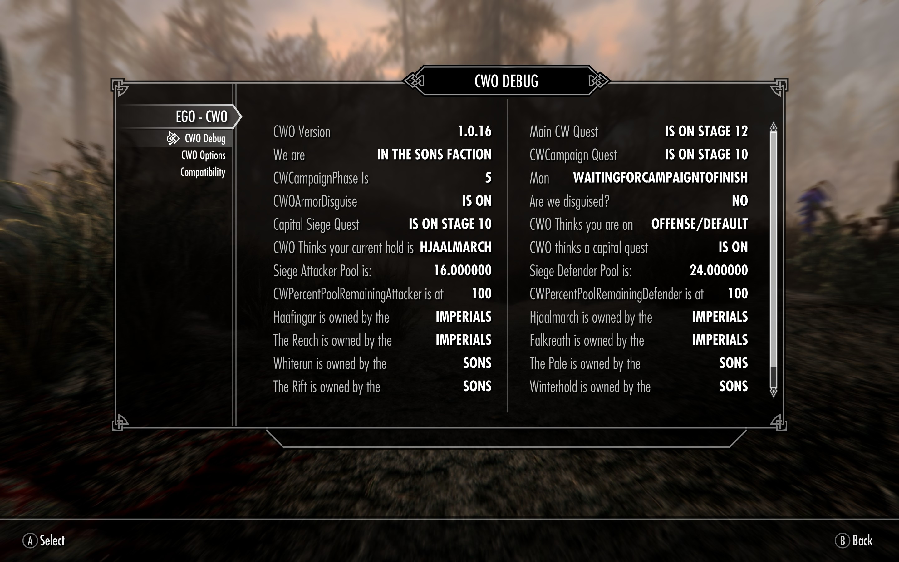

# Civil War Overhaul Redux - Logger #

## How to Open a CWO - Redux Bug ##

### Step 1. In game, take a screen of the CWO Debug. (Might require a few screenshots if some of the values go off the page) ###

### Step 2. Download and install the CWO Logger from the Mod page. It will be best when importing into the Mod Manager if you name it something else ###

### Step 3. Relaunch the game and try to do what you are stuck on. E.G. Re-do a Siege, re-speak to the commander/field co. In short, try to reproduce the problem. ###

### Step 4. There should now be a bunch of log files in your Documents folder now. (E.G. C:\Users\schof\Documents\My Games\Skyrim Special Edition\Logs\Script) Compress all of the files together. ###

### Step 5(a). Preferrably, you will open an issue in Github (https://github.com/schofida/CWORR/issues). You unfortunately will need a log-in but it is free, Github emails me directly so I don't miss it, and you can attach files. Please give me as much detail as possible in your description of the problem. Make sure you also include your screenshot of CWO Debug MCM and attach your log files. ###

### Step 5(b). If you prefer, you can open a bug on the Nexus. Same as above still apply (thorough description, log files and screenshot of CWO Debug). Unfortunately, Nexus does not alert me and it also does not allow for attachments so you would have to host your log files on Google Drive or Dropbox or something like that. ###

### Step 6. Then untick the CWO Logger (Logging incurs a performance hit on Skyrim's engine unfortunately.)

